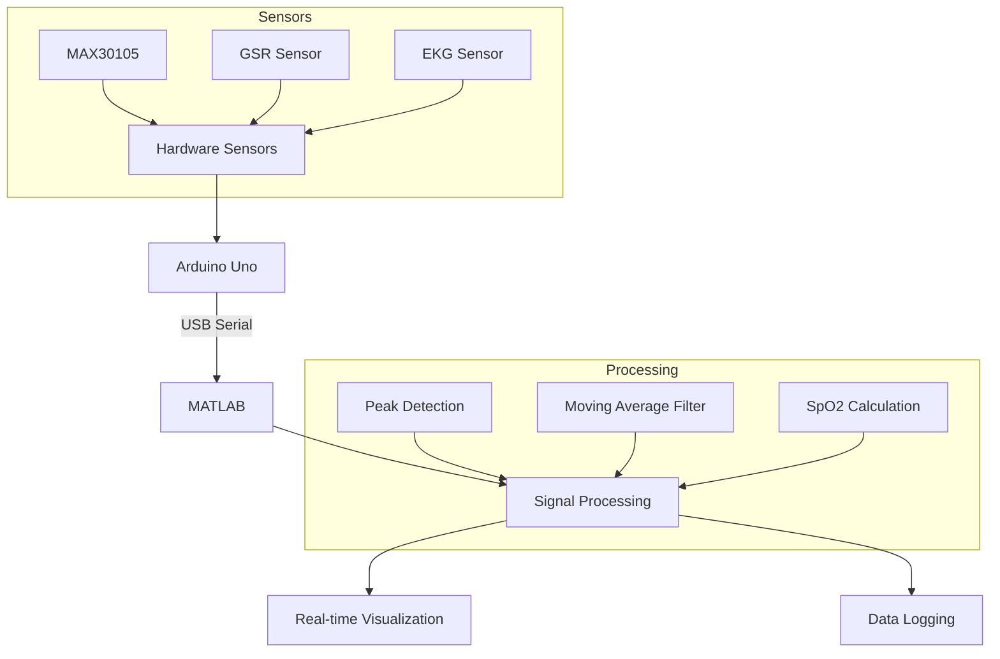

# Biomedical Sensor Data Acquisition System

## Overview
This project implements a real-time biomedical sensor data acquisition and visualization system using Arduino and MATLAB. It captures and displays multiple physiological parameters including heart rate, SpO₂, GSR (Galvanic Skin Response), EKG, and estimated blood pressure fluctuations.

## System Architecture


## Technical Specifications

### MAX30105 Sensor
- Operating Voltage: 1.8V to 3.3V
- I2C Address: 0x57
- Sample Rate: Up to 400Hz
- LED Wavelengths:
  - Red: 660nm
  - IR: 880nm
- Resolution: 18-bit
- Dynamic Range: 18.4μA to 375μA

### GSR Sensor
- Operating Voltage: 3.3V/5V
- Measurement Range: 10KΩ to 1MΩ
- Resolution: 12-bit ADC
- Response Time: <1s
- Output: Analog voltage

### EKG Sensor
- Operating Voltage: 3.3V/5V
- CMRR: >80dB
- Input Impedance: >100MΩ
- Bandwidth: 0.05Hz to 100Hz
- Gain: 1000

## Signal Processing Details

### Heart Rate Detection Algorithm
```matlab
% Peak detection with adaptive thresholding
if rawIR > peakThreshold && (currentTime - lastPeakTime) > minPeakInterval
    % Store peak intervals in circular buffer
    previousPeaks(peakIndex) = currentTime - lastPeakTime;
    peakIndex = mod(peakIndex, 10) + 1;
    
    % Calculate heart rate from valid intervals
    validPeaks = previousPeaks(previousPeaks > 0);
    if ~isempty(validPeaks)
        avgInterval = mean(validPeaks);
        heartRate = 60 / avgInterval;
        heartRate = min(max(heartRate, 40), 180);
    end
    lastPeakTime = currentTime;
end
```

### SpO₂ Calculation
```matlab
% R ratio calculation and SpO2 estimation
if rawIR > 100
    R = (rawRED / rawIR);
    spo2 = 110 - (25 * R);
    spo2 = min(max(spo2, 80), 100);
end
```

## Performance Benchmarks
- Sample Rate: 50Hz
- CPU Usage: ~15-20%
- Memory Usage: ~100MB
- Data Storage: ~1MB/minute
- Display Refresh: 50ms
- Signal Latency: <100ms

## Example Output
```
Time: 10.1, IR: 50000, Heart Rate: 72.5 BPM, SpO2: 98.2%
Time: 15.2, IR: 51200, Heart Rate: 73.1 BPM, SpO2: 98.5%
Time: 20.3, IR: 49800, Heart Rate: 72.8 BPM, SpO2: 98.3%
```

## Troubleshooting Guide

### Common Issues and Solutions

#### No Serial Connection
1. Check COM port number
2. Verify Arduino drivers
3. Try different USB cable
4. Reset Arduino board

#### Noisy Signals
1. Check sensor connections
2. Increase filter window size
3. Adjust peak detection threshold
4. Ensure proper sensor placement

#### High CPU Usage
1. Reduce sampling rate
2. Increase plot update interval
3. Reduce data window size
4. Close other applications

#### Data Logging Errors
1. Check write permissions
2. Verify available disk space
3. Close file in other applications
4. Use absolute file path

## Common Modifications

### Adjust Sampling Rate
```matlab
% In the main loop
pause(0.02); % 50Hz sampling
% Change to
pause(0.05); % 20Hz sampling
```

### Modify Filter Settings
```matlab
% Increase filter window for smoother output
filterSize = 10; % Default: 5

% Adjust peak detection sensitivity
peakThreshold = 4000; % Default: 5000
minPeakInterval = 0.5; % Default: 0.4
```

### Add New Sensor
```matlab
% In initialization
newSensorData = zeros(1, maxDataPoints);

% In main loop
rawNewSensor = readVoltage(a, "A2");
newSensorData = [newSensorData(2:end), rawNewSensor];

% Update plot
subplot(7,1,7); % Add new subplot
plot(timeData, newSensorData);
```

## Project Structure
```
biomedical-sensor/
├── README.md
├── src/
│   ├── main_acquisition.m
│   ├── signal_processing.m
│   └── visualization.m
├── docs/
│   ├── sensor_specs/
│   └── calibration_guide.md
└── data/
    └── sensor_data.csv
```

## Contributing
1. Fork the repository
2. Create a feature branch
3. Implement your changes
4. Add tests if applicable
5. Submit a pull request

### Code Style Guidelines
- Use clear variable names
- Comment complex algorithms
- Follow MATLAB best practices
- Include error handling
- Document function parameters

## License
MIT License

## Contact
- Author: [Your Name]
- Email: [Your Email]
- LinkedIn: [Your Profile]
- GitHub: [Your Username]

## Acknowledgments
- [Reference Papers]
- [Libraries Used]
- [Contributors]
